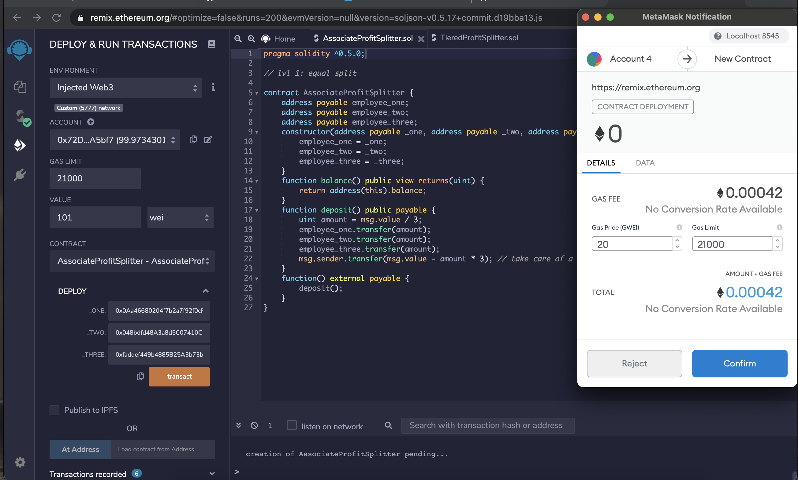
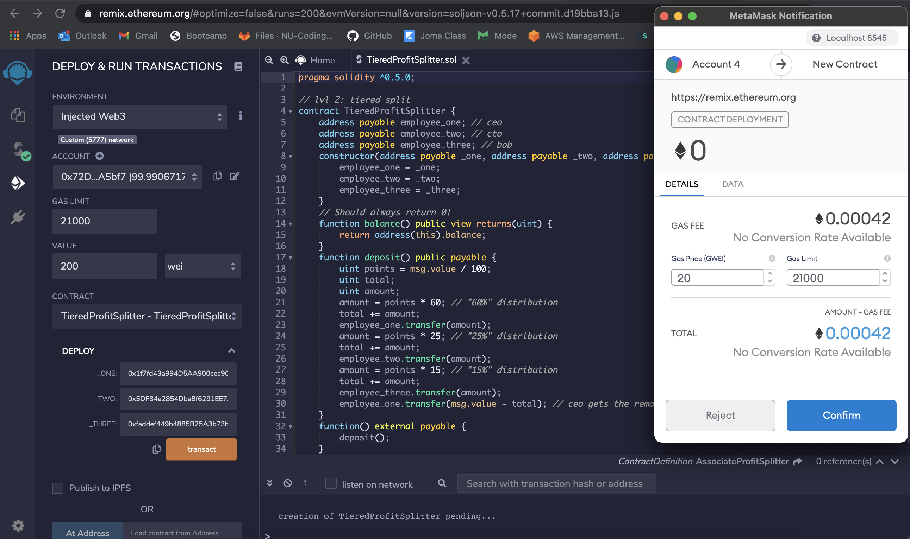
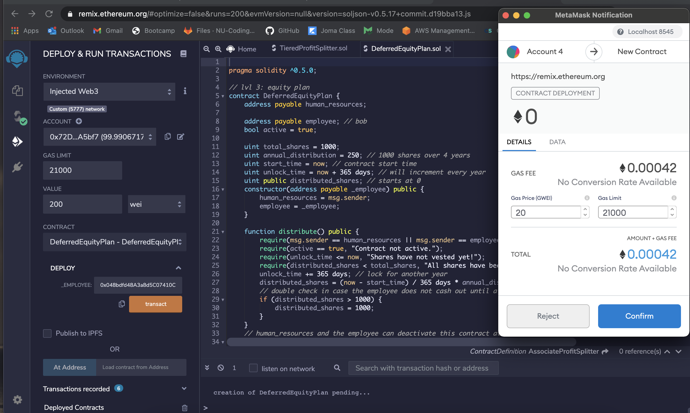

# Solidity

### Background 

The purpose of this project is to **build Smart Contracts** in Ethereum-compatible blockchain to help connect financial institutions, and the team to automate some company finances.

### Files

* [`AssociateProfitSplitter.sol`](Code-File/AssociateProfitSplitter.sol) -- Level 1 

* [`TieredProfitSplitter.sol`](Code-File/TieredProfitSplitter.sol) -- Level 2 

* [`DeferredEquityPlan.sol`](Code-File/DeferredEquityPlan.sol) -- Level 3

### Level One 

 [`AssociateProfitSplitter.sol`](Code-File/AssociateProfitSplitter.sol) contract. This will accept Ether into the contract and divide the Ether evenly among the associate level employees. This will allow the Human Resources department to pay employees quickly and efficiently.

### Level Two 

 [`TieredProfitSplitter.sol`](Code-File/TieredProfitSplitter.sol) will distribute different percentages of incoming Ether to employees at different tiers/levels. For example, the CEO gets paid 60%, CTO 25%, and Bob gets 15%.

### Level Three 

[`DeferredEquityPlan.sol`](Code-File/DeferredEquityPlan.sol) models traditional company stock plans. This contract will automatically manage 1000 shares with an annual distribution of 250 over 4 years for a single employee.

